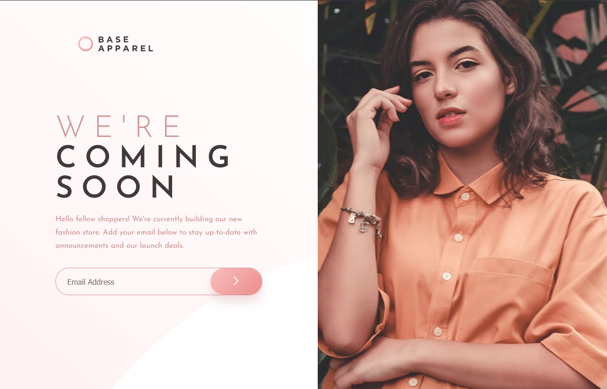

# Base Apparel coming soon

This is a solution to the [Base Apparel coming soon page challenge on Frontend Mentor] 

## Table of contents

- [The challenge](#the-challenge)
- [Screenshot](#screenshot)
- [Links](#links)
- [Built with](#built-with)
- [Author](#author)

### The challenge

Users should be able to:

- View the optimal layout for the site depending on their device's screen size
- See hover states for all interactive elements on the page
- Receive an error message when the `form` is submitted if:
  - The `input` field is empty
  - The email address is not formatted correctly

### Screenshot

### Links

- Live Site URL: (https://j-phillips-git.github.io/fem-base-apparel-landing-page/)

### Built with

- HTML5
- CSS
- JavaScript

## Author

- LinkedIn - [https://www.linkedin.com/in/jordan-phillips-/]
- Frontend Mentor - [https://www.frontendmentor.io/profile/JordanPhillips-hub]

